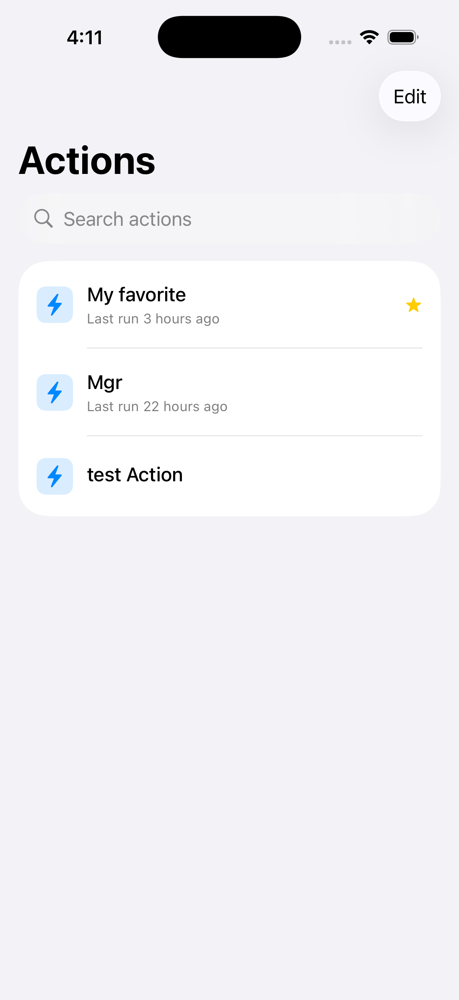
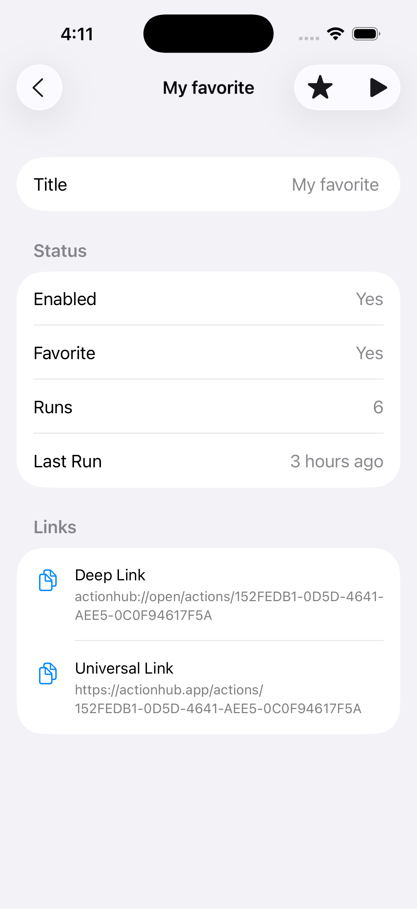
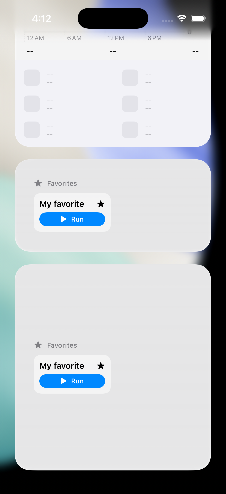
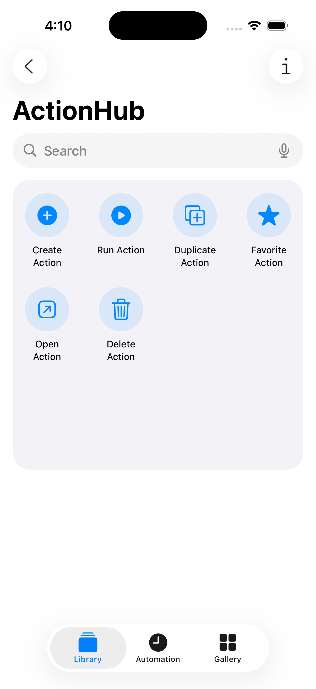

# ActionHub

ActionHub is an iOS app for creating, organizing, and running reusable **actions** — with deep system integration through App Intents, WidgetKit, Core Spotlight, Live Activities, and deep links.

Built with **SwiftUI**, **SwiftData**, and **MVVM**.

## Screenshots

> Screenshots coming soon. Add images to [`Docs/assets/`](Docs/assets/README.md) and update this section before your first public release.

## 📱 Screenshots

| Home | Detail | Widget | Shortcuts
|------|--------|--------|----------|
|  |  |  |  |

---

## Features

Only features that are **implemented in the current codebase**:

| Feature | Description |
|---------|-------------|
| **Actions library** | Browse, search, create, and delete actions from the home screen |
| **Favorites** | Star actions; filter the list via deep links (`/favorites`) |
| **Action detail** | View metadata, run history, deep/universal links, run and favorite actions |
| **Copy links** | Copy deep link and universal link URLs from the detail screen |
| **SwiftData persistence** | `Action`, `Category`, and `ExecutionHistory` models with App Group storage |
| **App Intents** | Create, run, delete, duplicate, favorite, and open actions |
| **App Shortcuts** | Siri phrases registered via `ActionHubAppShortcuts` |
| **Interactive widget** | Favorite Actions widget with run and unfavorite buttons |
| **Live Activities** | Lock Screen and Dynamic Island UI when an action runs |
| **Core Spotlight** | Actions indexed for system search; tap opens the app |
| **Deep links** | Custom URL scheme `actionhub://` |
| **Universal Links** | `https://actionhub.app/...` parsing (AASA template included; hosting required for production) |

### Not yet implemented

See [ROADMAP.md](ROADMAP.md) for action editing UI, category management, unit tests, and more.

---

## Architecture

ActionHub uses **MVVM** with a shared data layer:

```
┌─────────────────────────────────────────────────────────┐
│  ActionHub (App)          ActionHubWidget (Extension)   │
│  ┌─────────────┐          ┌─────────────────────────┐ │
│  │ Views       │          │ Widget + Live Activity UI │ │
│  │ ViewModels  │          └───────────┬─────────────┘ │
│  └──────┬──────┘                      │               │
│         │                             │               │
│         └─────────────┬───────────────┘               │
│                       ▼                               │
│              ┌─────────────────┐                      │
│              │ ActionRepository │  (Shared)           │
│              └────────┬────────┘                      │
│                       ▼                               │
│              ┌─────────────────┐                      │
│              │ SwiftData store  │  App Group          │
│              └─────────────────┘                      │
└─────────────────────────────────────────────────────────┘
```

- **Views** — SwiftUI only; minimal logic
- **ViewModels** — `@Observable`, `@MainActor` presentation state
- **ActionRepository** — Single entry point for mutations, side effects (Spotlight, widgets, shortcuts, Live Activities)
- **Shared/** — Code compiled into both the app and widget extension

Full details: [Docs/Architecture.md](Docs/Architecture.md)

---

## Folder Structure

```
ActionHub/
├── ActionHub/              Main app (Views, ViewModels, App entry)
├── ActionHubWidget/        Widget extension + Live Activity UI
├── Shared/                 Cross-target models, services, intents, utilities
├── Config/                 Info.plist supplements, AASA template
├── ActionHubTests/         Test folder scaffold (not wired to an Xcode test target yet)
├── Docs/                   Project documentation
├── .github/                Issue templates, PR template, CI workflow
├── ActionHub.xcodeproj/
├── PROJECT_RULES.md        Internal development conventions
├── ROADMAP.md
├── CHANGELOG.md
├── CONTRIBUTING.md
├── CODE_OF_CONDUCT.md
└── SECURITY.md
```

---

## Requirements

| Requirement | Version |
|-------------|---------|
| macOS | Sonoma or later (for Xcode 16) |
| Xcode | 16.0+ |
| iOS deployment target | 18.0 |
| Swift | 5.0 (project setting) |

Simulator or device running **iOS 18+**.

---

## Installation

### Clone the repository

```bash
git clone https://github.com/YOUR_USERNAME/ActionHub.git
cd ActionHub
```

### Open in Xcode

```bash
open ActionHub.xcodeproj
```

Select the **ActionHub** scheme (not `ActionHubWidgetExtension` alone).

### Signing

Update signing to your team in Xcode:

1. Select the **ActionHub** target → **Signing & Capabilities**
2. Select your **Team**
3. Repeat for **ActionHubWidgetExtension**

The project uses:

- Bundle ID: `com.sadaf.ActionHub`
- App Group: `group.com.sadaf.ActionHub`
- Associated domains: `actionhub.app`, `www.actionhub.app`

Change these if you fork the project for your own distribution.

---

## Running the Project

### From Xcode

1. Scheme: **ActionHub**
2. Destination: any iOS 18+ simulator or device
3. Press **⌘R**

### From the command line

```bash
xcodebuild \
  -scheme ActionHub \
  -destination 'platform=iOS Simulator,name=iPhone 16' \
  build
```

### Widget and Live Activities

The widget extension is embedded in the main app. After installing, add the **Favorite Actions** widget from the Home Screen widget gallery. Live Activities appear when you **run** an action (requires Live Activities enabled in Settings).

---

## Documentation

| Document | Description |
|----------|-------------|
| [Docs/Architecture.md](Docs/Architecture.md) | MVVM layout, data flow, targets |
| [Docs/SwiftData.md](Docs/SwiftData.md) | Models and persistence |
| [Docs/AppIntents.md](Docs/AppIntents.md) | Intents, entities, shortcuts |
| [Docs/Widgets.md](Docs/Widgets.md) | Favorite Actions widget |
| [Docs/LiveActivities.md](Docs/LiveActivities.md) | ActivityKit integration |
| [Docs/Spotlight.md](Docs/Spotlight.md) | Core Spotlight indexing |
| [Docs/DeepLinks.md](Docs/DeepLinks.md) | Custom scheme and Universal Links |
| [Docs/Siri.md](Docs/Siri.md) | App Shortcuts and Siri phrases |

---

## Roadmap

See [ROADMAP.md](ROADMAP.md) for completed work, in-progress items, and planned features.

---

## Contributing

Contributions are welcome. Please read [CONTRIBUTING.md](CONTRIBUTING.md) and [CODE_OF_CONDUCT.md](CODE_OF_CONDUCT.md) before opening a pull request.

---

## License

This project is licensed under the [MIT License](LICENSE).
